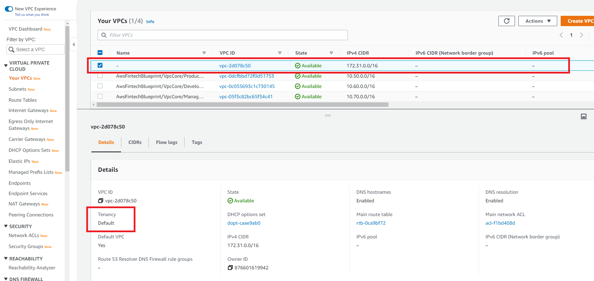
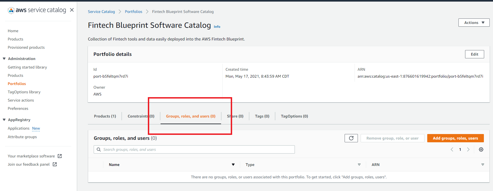

// Add steps as necessary for accessing the software, post-configuration, and testing. Don’t include full usage instructions for your software, but add links to your product documentation for that information.
//Should any sections not be applicable, remove them

=== Deployment Option 2: AWS CDK deployment

To deploy {partner-product-name} using AWS CDK, do the following:
[start=1]
. Verify that you have the https://docs.aws.amazon.com/cdk/latest/guide/getting_started.html#getting_started_prerequisites[prerequisites^] to install the AWS CDK. 

. https://docs.aws.amazon.com/cdk/latest/guide/getting_started.html#getting_started_install[Install the AWS CDK^].

. Clone the {partner-product-name} Quick Start repository.
```bash
git clone https://github.com/aws-quickstart/quickstart-aws-biotech-blueprint-cdk.git
cd quickstart-aws-biotech-blueprint-cdk
```
[start=4]
. Build the project.
```bash
npm install
npm run build 
```

[start=5]
. Bootstrap your AWS environment.
```bash
cdk bootstrap
```

NOTE: You can review and change code. For example, you can use different VPC CIDR ranges (`aws-vpcs.ts`) or a different internal DNS apex (`aws-dns.ts` defaults to `corp`). 

[start=6]
. Deploy.

```bash 
npm run build && cdk deploy
```

TIP: To update the architecture after making changes later, run the command in Step 6.

== Post deployment steps
// If Post-deployment steps are required, add them here. If not, remove the heading

=== Connect to the VPN

The Quick Start deploys a client VPN endpoint in the management VPC that will route traffic over peering connections to the production and development VPCs. The management VPC is the hub for networking into the other VPCs. The production and development VPCs are designed not to be able to communicate with each other directly. After deploying the Quick Start, follow these instructions to connect to the VPN.

[start=1]
. Navigate to the https://console.aws.amazon.com/vpc/home?#ClientVPNEndpoints:sort=clientVpnEndpointId[Client VPN Endpoint section in the AWS VPC web console^].
. Select the client VPN endpoint listed,
. Select *Download Client Configuration*. Your browser downloads a `downloaded-client-config.ovpn` file.
+
:xrefstyle: short
[#downloadclientconfig]
.Download Client Configuration
image::../images/downloadclientconfig.png[VPN,width=100%,height=100%]

[start=4]
. Navigate to the AWS S3 console.
. Open the bucket with the prefix `awsstartupblueprintstack-clientvpnvpnconfigbucket*`.
. Download the `client1.domain.tld.key` and `client1.domain.tld.crt`. 
+
NOTE: The other three files are the CA chain and server key/cert. You will need those to create additional client certificates.

[start=5]
. Open `downloaded-client-config.ovpn` in a text editor.
. Add the following lines to the bottom of the file. Replace the contents of the two files inside the respective `<cert>` and `<key>` sections.
+
```
<cert>
Contents of client certificate file (client1.domain.tld.crt)
</cert>

<key>
Contents of private key file (client1.domain.tld.key)
</key>
```

[start=7]
. Save and close the file. You can establish a VPN connection with the configuration and an OpenVPN client or AWS provided client. 

* https://docs.aws.amazon.com/vpn/latest/clientvpn-user/connect.html[Connect using an OpenVPN client^]
* https://docs.aws.amazon.com/vpn/latest/clientvpn-user/connect-aws-client-vpn-connect.html[Connect using an AWS provided client^]

With a VPN connection, you can connect to resources you launch into your VPCs using private IP addresses. For more information about deploying resources, see link:#_deploying_resources_into_VPCs[Deploying resources into VPCs], later in this guide. 

=== Deploying resources into VPCs

This Quick Start builds an architecture with three VPCs: production, development, and management. Use the management VPC for operational resources such as DevOps tools, Active Directory, and security appliances. For example, the Biotech Blueprint Quick Start deploys Client VPN endpoints into the public subnets of the management VPC. Production and development VPCs are provided so you can manage live and test environments with different levels of controls.  

Reserve public subnets for internet-facing resources such as load balancers. Use private subnets for resources that should not be internet-facing but require outbound internet access. Deploy sensitive resources such as databases addressable only by internal networks to isolated subnets which do not route traffic to the internet. For more information about public and private subnets, see https://docs.aws.amazon.com/vpc/latest/userguide/VPC_Scenario2.html[VPC with public and private subnets (NAT)^].

The following table provides some examples. 

[cols="1,1,1"]
|===
|Resource |VPC |Subnet

|Test server |Development |Private
|Amazon Relational Database Server (Amazon RDS) snapshot restored from development VPC |Production |Isolated
|Application Load Balancer to test a custom TLS certificate |Development |Public
|DevOps tool to automate deployments to production and development VPCs |Management |Private
|Okta Cloud Connect appliance |Management VPC |Private
|===


=== Optional DNS setup
The Quick Start sets up a private DNS with `.corp` as the apex domain using https://console.aws.amazon.com/route53/v2/home#Dashboard[Amazon Route 53 in your account^]. Using the Amazon Route 53 console, you can create `A` or `CNAME` records to private applications you deploy. 

=== Delete the default VPC

Every new AWS account comes with a default VPC with public subnets in each Availability Zone. It is recommended that you delete this default VPC and only deploy resources into the production, management, and development VPCs that the Biotech Blueprint Quick Start provisions. If you have already deployed resources into the default VPC before launching the Quick Start, it is recommended that you migrate these resources to the Biotech Blueprint VPCs and then delete the default VPC. Removing the default VPC will ensure that a user does not launch resources into one of its exposed public subnets.

<<defaultvpc>> shows the default VPC listed in the Amazon VPC console with the VPCs created by the Biotech Blueprint Quick Start.

:xrefstyle: short
[#defaultvpc]
.Default VPC


//== Test the deployment
// If steps are required to test the deployment, add them here. If not, remove the heading


//== Best practices for using {partner-product-short-name} on AWS
// Provide post-deployment best practices for using the technology on AWS, including considerations such as migrating data, backups, ensuring high performance, high availability, etc. Link to software documentation for detailed information.

//_Add any best practices for using the software._

== Security and Compliance
// Provide post-deployment best practices for using the technology on AWS, including considerations such as migrating data, backups, ensuring high performance, high availability, etc. Link to software documentation for detailed information.

The Quick Start deploys the following AWS Config conformance packs: 

* https://docs.aws.amazon.com/config/latest/developerguide/operational-best-practices-for-hipaa_security.html[Operational Best Practices for HIPAA Security]
* https://docs.aws.amazon.com/config/latest/developerguide/operational-best-practices-for-aws-identity-and-access-management.html[Operational Best Practices For AWS Identity And Access Management]
* https://docs.aws.amazon.com/config/latest/developerguide/operational-best-practices-for-amazon-s3.html[Operational Best Practices For Amazon S3]
* https://docs.aws.amazon.com/config/latest/developerguide/operational-best-practices-for-nist-csf.html[Operational Best Practices for NIST CSF]
* https://docs.aws.amazon.com/config/latest/developerguide/aws-control-tower-detective-guardrails.html[AWS Control Tower Detective Guardrails Conformance Pack]

These packs create AWS Config rules that regularly evaluate resources in your AWS account against security best practices. When AWS Config finds an offending resource, it will flag it for your review in the AWS Config console. AWS Config also scans resources created in your account before deploying the Quick Start.

For example, the Operational Best Practices for NIST Cyber Security Framework (CSF) conformance pack comes with 93 rules. One of which is `encrypted-volumes-conformance-pack`, which checks whether attached Amazon Elastic Block Store (Amazon EBS) volumes are encrypted. 

:xrefstyle: short
[#nist]
.Operational Best Practices for NIST-CSF


Select `encrypted-volumes-conformance-pack` to display a list of relevant resources and their compliance status. 

:xrefstyle: short
[#encryptedvolumes]
.Encrytped volumes conformance pack


You can update the AWS Config delivery channel to include an Amazon Simple Notification Service (Amazon SNS) topic to send email or text notifications when resources are flagged. More sophisticated approaches might include regularly reviewing AWS Config reports, using AWS Config's automatic remediation capabilities, or integrating AWS Config with security ticketing or SEIM solutions. 

=== Operational Best Practices for HIPAA Security conformance pack

While the Health Insurance Portability and Accountability Act (HIPAA) might not be a concern for every user of this Quick Start, many store, transmit, or process protected health information (PHI). Whether you handle PHI or not, the HIPAA security conformance pack has over 80 rules that capture a number of best practices that any user should consider implementing.

If you do have HIPAA/PHI needs, it is strongly encouraged that you read  https://docs.aws.amazon.com/config/latest/developerguide/operational-best-practices-for-hipaa_security.html[Operational Best Practices for HIPAA Security].

WARNING: AWS Config conformance packs provide a general-purpose compliance framework designed to enable you to create security, operational or cost-optimization governance checks using managed or custom AWS Config rules and AWS Config remediation actions. Conformance packs, as sample templates, are not designed to fully ensure compliance with a specific governance or compliance standard. You are responsible for making your own assessment of whether your use of the Services meets applicable legal and regulatory requirements.

//_Add any security-related information._

== Restricting IAM actions to specific AWS Regions 

You can restrict IAM actions to EU or US AWS Regions. For example, you may want to restrict the creation of Amazon Elastic Compute Cloud (Amazon EC2) instances or AWS Simple Storage Service (Amazon S3) buckets to only European Regions. This could be for compliance reasons or simply because its a good practice to keep resources out of Regions you never intend to use. If you have a single AWS account, the best way to enforce AWS Region restrictions is with an https://docs.aws.amazon.com/IAM/latest/UserGuide/access_policies_boundaries.html[IAM permission boundary^]. The `RegionRestriction` class configured in `lib/aws-startup-blueprint-stack.ts` creates an IAM permission boundary. It restricts IAM actions to the AWS Regions you specify. For example:

```typescript
      new RegionRestriction(this, 'RegionRestriction', {
        AllowedRegions: ["eu-central-1","eu-west-1","eu-west-3", "eu-south-1", "eu-north-1"]
      });  
```

<<<<<<< HEAD
To apply the Region restriction, set the context variable `apply_EU_RegionRestriction` or `apply_US_RegionRestriction) in the `cdk.json` file to `true`. Then run `cdk deploy` again.
=======
We have added some helper context variables (`apply_EU_RegionRestriction` and `apply_US_RegionRestriction`) inside the the `cdk.json` file. Setting one of those to `"true"` and running `cdk deploy` again will apply the region restriction.

In order for the permission boundary to have any effect, it needs to be attached to all existing and future IAM users and roles. As a best practice, you should always attach this permission boundary when creating any future IAM user or role. While a best practice, sometimes good intentions are forgotten. To enforce the permission boundary gets attached, the `RegionRestriction` class also creates an AWS Config Rule and Remediation to detect and automatically fix a missing permission boundary to any existing, updated, or future IAM principals. 

To enforce the permission boundary, the `RegionRestriction` class creates an AWS Config rule to detect and remediate a missing IAM permission boundary. 
>>>>>>> doc-edits

In order for the permission boundary to have any effect, it should be attached to all existing and future IAM users and roles. To enforce the permission boundary, the `RegionRestriction` class creates an AWS Config rule to detect and remediate a missing IAM permission boundary. For example, in AWS Config Rules console, select the `AwsBiotechBlueprint-RegionRestriction` rule.

:xrefstyle: short
[#rules]
.AwsBiotechBlueprint-RegionRestriction rule
image::../images/regionrestriction_config0.png[Config,width=100%,height=100%]

The Config Rule evaluates your IAM users and roles and lists their compliance status. To remediate a non-compliant resource, select the resource and select *Remediate*. The service control policy is applied and that user or role will no longer be able to perform any action outside of the specified Region. 

image::../images/regionrestriction_config1.png[Config,width=100%,height=100%]

After the remediation is complete, AWS CloudTrail triggers the AWS Config rule. CloudTrail tells AWS Config that that the IAM principal has been updated and that its time to reevaluate the offending resource (takes about 15 minutes). Because the boundary has been applied, the reevaluation will report the role or user as compliant.

=== Enabling automatic remediation

The Biotech Blueprint Quick Start intentionally leaves the remediation configuration set to *Manual* instead of *Automatic*. This is in the event you have existing IAM users or roles. Automatically applying the remediation and attaching the permission boundary will impact those existing IAM principals permissions. You should verify if any of the flagged IAM principals depend on any non-approved Regions before applying the boundary. If you are working in a brand new account or are unconcerned about the impact on existing IAM principals, you can turn on automatic remediation by following these steps: 

WARNING: Enabling automatic remediation will impact existing IAM users and roles not created by the Biotech Blueprint.

[start=1]
. In the AWS Config console, select *Edit* in the *Remediation Action* section of the `AwsBiotechBlueprint-RegionRestriction` AWS Config rule. 

:xrefstyle: short
[#ruleedit]
.AwsBiotechBlueprint-RegionRestriction rule
image::../images/regionrestriction_config2.png[Config,width=100%,height=100%]

[start=2]
. Select *Automatic Remediation*.
. Select *Save changes*.

:xrefstyle: short
[#editaction]
.Edit Remediation action
image::../images/regionrestriction_config3.png[Config,width=100%,height=100%]

=== AWS Region restriction in multi-account configurations

In a multi-account setup, Service Control Polices (SCPs) are superior to permission boundaries. SCPs are applied across an entire account and do not need to be individually attached to IAM principals. However, if you have only one account, use permission boundaries discussed previously to restrict Regions. SCPs only apply to sub-accounts. When you create a new account, the Region-restricting SCP created by the Biotech Blueprint will be applied automatically to any new account you create.

For more information about the service control policy, see https://console.aws.amazon.com/iam/home?organizations/ServiceControlPolicies/#/organizations/ServiceControlPolicies[IAM Console]

:xrefstyle: short
[#regionrestriction]
.RegionRestriction


== AWS Service Catalog

After deploying the Biotech Blueprint Quick Start, you can launch a selection of informatics and scientific applications from the https://us-east-1.console.aws.amazon.com/servicecatalog/home?isSceuc=true&region=us-east-1#/products[AWS Service Catalog console^]. You can also deploy these from the launch links provided on their Quick Start pages and in their deployment guides. The following table provides information to learn more about the available applications.

[cols="1,1,1,1"]
|===
|Category |Partner |Product |To install

|Compound registry |ChemAxon |https://chemaxon.com/products/compound-registration[Compound Registration^] |https://fwd.aws/x45Rg[Launch Quick Start template^]
|Genomics analysis |Nextflow |https://www.nextflow.io/[Nextflow^] |https://fwd.aws/ejxNx[Quick Start page] \| https://fwd.aws/B4VnD[View guide^]
|Genomics analysis |Hail |https://hail.is/docs/0.2/index.html[Hail 0.2^] |https://fwd.aws/w9E8d[Quick Start page^] \| https://fwd.aws/GMvwj[View guide^]
|Knowledge management |Dotmatics |https://www.dotmatics.com/[Dotmatics suite^] |https://fwd.aws/A5K9B[Quick Start page^] \| https://fwd.aws/RvJpR[View guide^]
|Sample management |Titian |https://www.titian.co.uk/products/aws-mosaic-freezermanagement[Mosaic FreezerManagement^] |https://fwd.aws/E736X[Quick Start page^] \| https://fwd.aws/KNmPd[View guide^]
|===

=== AWS Service Catalog permissions
Access to AWS Service Catalog requires credentials. Those credentials must have permission to access AWS resources, such as an AWS Service Catalog portfolio or product. AWS Service Catalog integrates with AWS Identity and Access Management (IAM) to enable you to grant AWS Service Catalog end users permissions to launch products and manage provisioned products. To control access, you attach these policies to the IAM users, groups, and roles that you use with AWS Service Catalog.

[start=1]
. Navigate to the https://console.aws.amazon.com/servicecatalog/home?#portfolios?activeTab=localAdminPortfolios[AWS Service Catalog console^]. 
. Select the *Biotech Blueprint Informatics Catalog* portfolio.
. Select the *Groups, roles, and users* tab.

:xrefstyle: short
[#scpermissions]
.Quick Start architecture for {partner-product-short-name} on AWS


[start=4]
. Select *Add groups, users, and roles*.
. Select the IAM identities requiring AWS Service Catalog permissions. Do not forget to include yourself if you need permissions.
