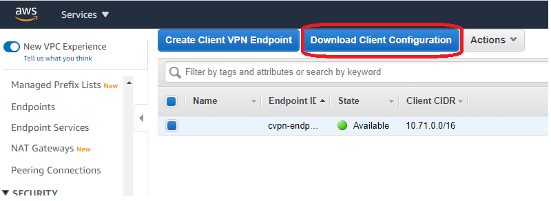
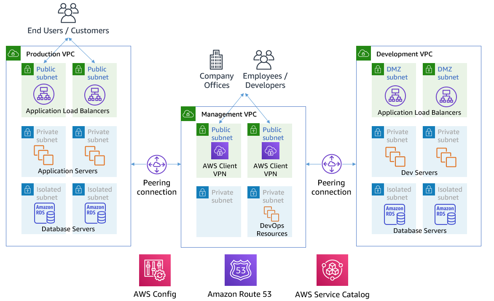
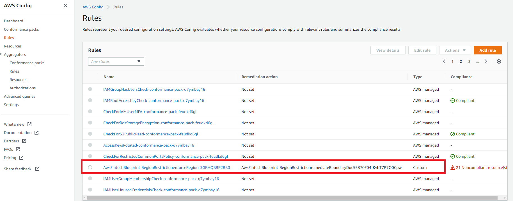
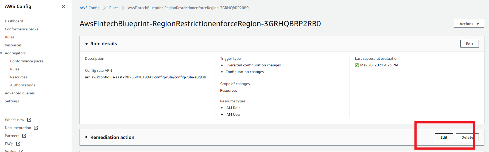

// Add steps as necessary for accessing the software, post-configuration, and testing. Don’t include full usage instructions for your software, but add links to your product documentation for that information.
//Should any sections not be applicable, remove them


== Post deployment steps
// If Post-deployment steps are required, add them here. If not, remove the heading

=== Connect to the VPN

In order for you to route into the private subnets in the VPCs, you need to connect to the VPN. The blueprint has deployed a client vpn endpoint in the Management VPC that will NAT traffic over peering connections into the Production and Development VPCs. We are using the Management VPC as a hub VPC for networking into other VPCs. The Development and Production environments are designed to NOT be able to communicate with each other.


[start=1]
. Navigate to the https://console.aws.amazon.com/vpc/home?#ClientVPNEndpoints:sort=clientVpnEndpointId[Client VPN Endpoint section in the AWS VPC web console^].
. Select the client VPN endpoint listed,
. Select *Download Client Configuration*. Your browser downloads a `downloaded-client-config.ovpn` file.
+
:xrefstyle: short
[#downloadclientconfig]
.Download Client Configuration


[start=4]
. Navigate to the AWS S3 console.
. Open the bucket with the prefix `awsstartupblueprintstack-clientvpnvpnconfigbucket*`.
. Download the `client1.domain.tld.key` and `client1.domain.tld.crt`. 
+
NOTE: The other three files are the CA chain and server key/cert. You will need those to create additional client certificates.

[start=5]
. Open `downloaded-client-config.ovpn` in a text editor.
. Add the following lines to the bottom of the file. Replace the contents of the two files inside the respective `<cert>` and `<key>` sections.
+
```
<cert>
Contents of client certificate file (client1.domain.tld.crt)
</cert>

<key>
Contents of private key file (client1.domain.tld.key)
</key>
```

[start=7]
. Save and close the file. You can establish a VPN connection with the configuration and an OpenVPN client or AWS provided client. 

* https://docs.aws.amazon.com/vpn/latest/clientvpn-user/connect.html[Connect using an OpenVPN client^]
* https://docs.aws.amazon.com/vpn/latest/clientvpn-user/connect-aws-client-vpn-connect.html[Connect using an AWS provided client^]

With a VPN connection, you can connect to resources you launch into your VPCs using private IP addresses. For more information about deploying resources, see link:#_deploying_resources_into_VPCs[Deploying resources into VPCs], later in this guide. 

=== Deploying resources into VPCs

This Quick Start builds an architecture with three VPCs: production, development, and management. Use the management VPC for operational resources such as DevOps tools, Active Directory, and security appliances. For example, the Biotech Blueprint Quick Start deploys Client VPN endpoints into the public subnets of the management VPC. Production and development VPCs are provided so you can manage live and test environments with different levels of controls.  

Reserve public subnets for internet-facing resources such as load balancers. Use private subnets for resources that should not be internet-facing but require outbound internet access. Deploy sensitive resources such as databases addressable only by internal networks to isolated subnets which do not route traffic to the internet. For more information about public and private subnets, see https://docs.aws.amazon.com/vpc/latest/userguide/VPC_Scenario2.html[VPC with public and private subnets (NAT)^].

The following table provides some examples. 

[cols="1,1,1"]
|===
|Resource |VPC |Subnet

|Test server |Development |Private
|Amazon Relational Database Server (Amazon RDS) snapshot restored from development VPC |Production |Isolated
|Application Load Balancer to test a custom TLS certificate |Development |Public
|DevOps tool to automate deployments to production and development VPCs |Management |Private
|Okta Cloud Connect appliance |Management VPC |Private
|===


=== Optional DNS setup
The Quick Start sets up a private DNS with `.corp` as the apex domain using https://console.aws.amazon.com/route53/v2/home#Dashboard[Amazon Route 53 in your account^]. Using the Amazon Route 53 console, you can create `A` or `CNAME` records to private applications you deploy. 

=== Delete the default VPC

Every new AWS account comes with a default VPC with public subnets in each Availability Zone. It is recommended that you delete this default VPC and only deploy resources into the production, management, and development VPCs that the Biotech Blueprint Quick Start provisions. If you have already deployed resources into the default VPC before launching the Quick Start, it is recommended that you migrate these resources to the Biotech Blueprint VPCs and then delete the default VPC. Removing the default VPC will ensure that a user does not launch resources into one of its exposed public subnets.

<<defaultvpc>> shows the default VPC listed in the Amazon VPC console with the VPCs created by the Biotech Blueprint Quick Start.

:xrefstyle: short
[#defaultvpc]
.Default VPC
image::../images/defaultvpc_0.png[Config,width=100%,height=100%]

//== Test the deployment
// If steps are required to test the deployment, add them here. If not, remove the heading


//== Best practices for using {partner-product-short-name} on AWS
// Provide post-deployment best practices for using the technology on AWS, including considerations such as migrating data, backups, ensuring high performance, high availability, etc. Link to software documentation for detailed information.

//_Add any best practices for using the software._

== Security and Compliance
// Provide post-deployment best practices for using the technology on AWS, including considerations such as migrating data, backups, ensuring high performance, high availability, etc. Link to software documentation for detailed information.

The Quick Start deploys the following AWS Config conformance packs: 

* https://docs.aws.amazon.com/config/latest/developerguide/XXXXXXXXXXXXX
* https://docs.aws.amazon.com/config/latest/developerguide/operational-best-practices-for-aws-identity-and-access-management.html[Operational Best Practices For AWS Identity And Access Management]
* https://docs.aws.amazon.com/config/latest/developerguide/operational-best-practices-for-amazon-s3.html[Operational Best Practices For Amazon S3]
* https://docs.aws.amazon.com/config/latest/developerguide/operational-best-practices-for-nist-csf.html[Operational Best Practices for NIST CSF]
* https://docs.aws.amazon.com/config/latest/developerguide/aws-control-tower-detective-guardrails.html[AWS Control Tower Detective Guardrails Conformance Pack]


These packs create a number of AWS Config rules that regularly evaluate resources in your account against security best practices. When AWS Config finds an offending resource, it will flag it for your review in the AWS Config Console. Any resources you created in your account BEFORE you deployed the Blueprint will also be scanned during the next AWS Config Rule evaluation. This can be handy to help identify resources you are already using, or create in the future, that fall short of the best practices defined in the Config packs above.

For example, the Operational Best Practices for NIST Cyber Security Framework (CSF) conformance pack comes with 93 rules. One of which is `encrypted-volumes-conformance-pack`, which checks whether attached Amazon Elastic Block Store (Amazon EBS) volumes are encrypted. 

:xrefstyle: short
[#nist]
.Operational Best Practices for NIST-CSF
image::../images/conformancepacks_0.png[Config,width=100%,height=100%]

Select `encrypted-volumes-conformance-pack` to display a list of relevant resources and their compliance status. 

:xrefstyle: short
[#encryptedvolumes]
.Encrytped volumes conformance pack
image::../images/conformancepacks_1.png[Config,width=100%,height=100%]

You can update the AWS Config delivery channel to include an Amazon Simple Notification Service (Amazon SNS) topic to send email or text notifications when resources are flagged. More sophisticated approaches might include regularly reviewing AWS Config reports, using AWS Config's automatic remediation capabilities, or integrating AWS Config with security ticketing or SEIM solutions. 

=== Notes on the Operational Best Practices for PCI-DSS-3.2.1 pack

While PCI might not be a concern for every Fintech, a many may eventually store/transmit/process payment data. Whether you have PCI requriements or not, the PCI security conformance pack has >140 rules that still capture a number of best practices that any secure company should consider implementing.

If you do have PCI needs, it is *strongly* encouraged that you check out the https://docs.aws.amazon.com/config/latest/developerguide/operational-best-practices-for-pci-dss.html[documentation on the config pack]. For every config rule included in the pack, there is a corresponding PCI control ID along with AWS guidance for each check. This Conformance Pack was validated by AWS Security Assurance Services LLC (AWS SAS), which is a team of Payment Card Industry Qualified Security Assessors (QSAs), HITRUST Certified Common Security Framework Practitioners (CCSFPs), and compliance professionals certified to provide guidance and assessments for various industry frameworks. AWS SAS professionals designed this Conformance Pack to enable a customer to align to a subset of the HIPAA.

=== Notes Operational Best Practices for HIPAA Security conformance pack

While the Health Insurance Portability and Accountability Act (HIPAA) might not be a concern for every user of this Quick Start, many store, transmit, or process protected health information (PHI). Whether you handle PHI or not, the HIPAA security conformance pack has over 80 rules that capture a number of best practices that any user should consider implementing.

If you do have HIPAA/PHI needs, it is strongly encouraged that you read  https://docs.aws.amazon.com/config/latest/developerguide/operational-best-practices-for-hipaa_security.html[Operational Best Practices for HIPAA Security].

WARNING: AWS Config conformance packs provide a general-purpose compliance framework designed to enable you to create security, operational or cost-optimization governance checks using managed or custom AWS Config rules and AWS Config remediation actions. Conformance packs, as sample templates, are not designed to fully ensure compliance with a specific governance or compliance standard. You are responsible for making your own assessment of whether your use of the Services meets applicable legal and regulatory requirements.

       
== Other useful information
//Provide any other information of interest to users, especially focusing on areas where AWS or cloud usage differs from on-premises usage.


=== Where to go from here?
Once you are connected to the VPN, you essentially have a private encrypted channel into your new VPCs. You can now connect to any resources you launch into your VPCs using private IP addresses without having to hassle with insecure/public bastion hosts. 

Are you unsure where to launch your first server? If you are confused about which VPC and/or which subnets you should be deploying resources into, check out the FAQ section. We did our best to explain some of the theory and give some concrete examples.  

We've filled out some of the subnets in the diagram below to give an generalized example of the sorts of things you may end up deploying into your VPCs and subnets.




=== (Optional) DNS Setup
A private DNS is setup by the Blueprint with `.corp` (default) as the apex domain using https://console.aws.amazon.com/route53/v2/home#Dashboard[Amazon Route 53 in your account]. From there, you can create private A or CNAME records to any private resources you create. 

For example, you may decide to launch a development server that gets a private IP like `10.60.0.198`. Instead of you having to remember that IP, you can create an 'A' record in the .corp Route 53 hosted zone for `pauls-machine.corp` to the private IP `10.60.0.198`. Resources in all three VPCs, and clients connected to the Client VPN Endpoint, will then all be able to resolve `pauls-machine.corp` from a browser, terminal, api call, etc.

=== (Optional) Enable Fintech Blueprint Informatics Catalog

All of the Fintech tooling made available through the Blueprint is deployed through AWS Service Catalog as the `Fintech Blueprint Catalog`. 

Service Catalog requires that you explicitly give permissions to individual IAM users/groups/roles to launch products from a Service Catalog portfolio. 

To grant that permission you first need to visit the https://console.aws.amazon.com/servicecatalog/home?#portfolios?activeTab=localAdminPortfolios[Service Catalog Portfolio Console]. 

Click on the `Fintech Blueprint Informatics Catalog` portfolio and then the `Groups, roles, and users` tab. 

image::../images/service-catalog-permission.png[scpermission,width=100%,height=100%]

Click on the `Add groups, users, and roles` button and select any IAM users/groups/roles that you want grant permissions to. *Make sure you add yourself.*

Anyone you just added can now visit the https://us-east-1.console.aws.amazon.com/servicecatalog/home?isSceuc=true&region=us-east-1#/products['Products list' section of the Service Catalog console] and deploy any of the tools listed.

For example, you or another user could now go to the Service Catalog console and deploy the SWIFT Client Connectivity solution:


Please reference the following documentation pages for tool specific deployment and usage instructions:

==== SWIFT Client Connectivity on AWS

Deploying this product from the Fintech Blueprint Service Catalog portfolio will stand up an AWS CodePipeline that automatically deploys the https://aws-quickstart.github.io/quickstart-swift-digital-connectivity/[SWIFT Client Connectivity^], a standardized environment for connecting to the SWIFT network, into your AWS account. It takes about 4-5 minutes for Service Catalog to deploy the CodePipeline at which point it will report "Available". While the CodePipeline and supporting assets are available, itself takes about 45 minutes to deploy everything else. You can observe the progress in the Code Pipeline console. 


=== (Optional) Delete the "Default VPC"

Every brand new account created in AWS automatically comes with a "Default VPC". You will see it listed in the VPC console list alongside the Production, Management, and Development VPCs that the Blueprint created. 

image::../images/defaultvpc_0.png[Config,width=100%,height=100%]

The default VPC consists of *public* subnets in every availability zone. It is a fundamentally insecure VPC and should not be used. If you are starting from a brand new account, and know you have never launched anything into the default VPC, you are best off *DELETING* the Default VPC, right from the start, and only using the VPCs created by the Blueprint. If you have already launched a resources into the Default VPC, you should begin migrating them to the VPCs created by the Blueprint, and *then* delete the Default VPC. By deleting the Default VPC, you will drastically reduce the likelihood a user mistakenly launches a resource into an exposed public subnet. 

TIP: If you have a brand new account, delete the Default VPC as soon as possible. If you have already have resources using the Default VPC, migrate them to Blueprint VPCs, then delete the Default VPC.

== Region Restriction Capabilities 

A common ask from Startups using AWS is to restrict all IAM actions to specific regions. For example, you may only want users to create EC2 instances or S3 buckets in EU-only regions. This could be for compliance reasons or simply because its a good practice to keep resources out of regions you never intend to use. 


If you have a single AWS account, the best way to enforce region restrictions is with an https://docs.aws.amazon.com/IAM/latest/UserGuide/access_policies_boundaries.html[IAM permission boundary]. IAM permission boundaries are similar to, but distinct from, identity polices that you may be familiar with. An entity's permissions boundary allows it to perform only the actions that are allowed by both its identity-based policies *and* it's permissions boundaries. This means that even the broadest identity-based permission polices like 'arn:aws:iam::aws:policy/AdministratorAccess', which gives * access to *, will still be denied if the principal's permission boundary does not allow it.

The `RegionRestriction` class configured in 'lib/aws-startup-blueprint-stack.ts' creates just such an IAM permission boundary restriction actions to the regions you specify:

For example:

```typescript
      new RegionRestriction(this, 'RegionRestriction', {
        AllowedRegions: ["eu-central-1","eu-west-1","eu-west-3", "eu-south-1", "eu-north-1"]
      });  
```


We have added some helper context variables (`apply_EU_RegionRestriction` and `apply_US_RegionRestriction`) inside the the `cdk.json` file. Setting one of those to `"true"` and running `cdk deploy` again will apply the region restriction.

In order for the permission boundary to have any effect, it needs to be attached to all existing and future IAM users and roles. As a best practice, you should always attach this permission boundary when creating any future IAM user or role. While a best practice, sometimes good intentions are forgotten. To enforce the permission boundary, the `RegionRestriction` class also creates an AWS Config Rule and Remediation to detect and automatically fix a missing permission boundary to any existing, updated, or future IAM principals. 

If you visit the AWS Config Rules console, find and click on the rule titled `AwsFintechBlueprint-RegionRestriction...`



The Config Rule will have evaluated all of your IAM users and roles and listed their compliance status. You can quickly remediate a non-compliant resource by selecting the radio button next to it and clicking the 'Remediate' button. That will immediately apply the service control policy and that user or role will no longer be able to perform any action outside of the region you specified. 

image::../images/regionrestriction_config1.png[Config,width=100%,height=100%]

After the remediation is complete, AWS CloudTrail will eventually trigger the AWS Config rule. CloudTrail tells Config that that the IAM principal has been updated and that its time to reevaluate the offending resource (takes about 15 minutes). Because the boundary has been applied, the reevaluation will report the role or user as compliant.


*What about automatically remediating resources?* The Blueprint intentionally leaves the remediation configuration set to "Manual" instead of "Automatic". This is in the event you have existing IAM users or roles. Automatically applying the remediation and attaching the permission boundary will impact those existing IAM principals permissions. You should verify if any of the flagged IAM principals depend on any non-approved regions before applying the boundary. If you are working in a brand new account or are unconcerned about the impact on existing IAM principals, you turn on automatic remediation: 

Click the edit button in the "Remediation Action" section of the `AwsFintechBlueprint-RegionRestriction` Config Rule. 



WARNING: Turning on automatic remediation will impact existing IAM users and roles not created by the Blueprint itself.

Select the "Automatic Remediation" radio button and click "Save changes"


=== Region Restriction Capabilities in Multi Account Configurations:

In a multi-account setup, Service Control Polices (SCPs) are superior to Permission Boundaries. SCPs are applied across an entire account and don't need to be individually attached to IAM principals. The only hiccup with SCPs is that they can only take effect on your sub-accounts. So if you just have one account right now, SCPs can't really help. Thats just fine! The permission boundary and Config approach are enough restrict regions in a single account setup. But when the time comes to create a new account, the Blueprint has already created a region restricting SCP that will automatically be applied to any new account you create right off the bat.

You can take a look at the service control policy by looking at it in the https://console.aws.amazon.com/iam/home?organizations/ServiceControlPolicies/#/organizations/ServiceControlPolicies[IAM Console]

TIP: The SCP created by the applies only to your sub accounts, if and when you create them!

image::../images/regionrestriction_config4.png[Config,width=100%,height=100%]


