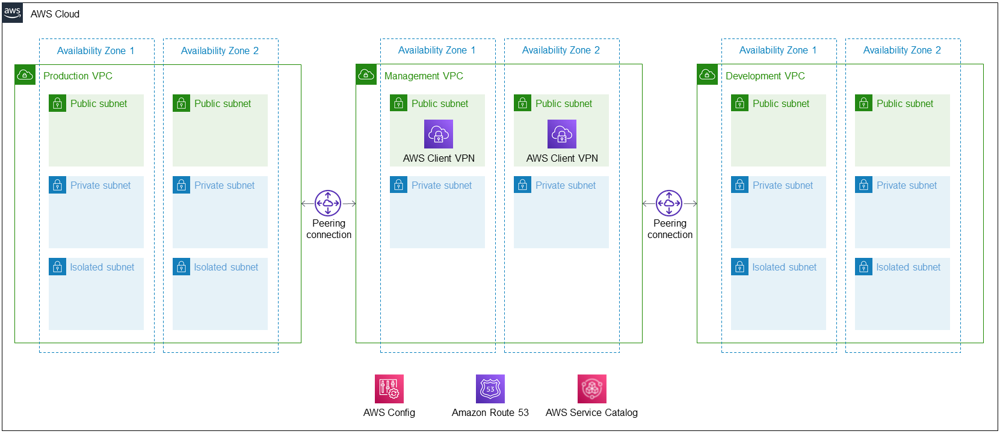

Deploying this Quick Start for a new virtual private cloud (VPC) with default parameters builds the following {partner-product-short-name} environment in the AWS Cloud.

:xrefstyle: short
[#architecture1]
.Quick Start architecture for {partner-product-short-name} on AWS

As shown in <<architecture1>>, the Quick Start sets up the following:

* A highly available architecture with three virtual private clouds (VPCs), each with two Availability Zones. VPCs contain public and private subnets according to AWS best practices, to provide you with your own virtual network on AWS.
** A production VPC into which you can deploy optional research and informatics software from the AWS Service Catalog.
** A management VPC with AWS Client VPN endpoints in the public subnets. 
** A development VPC to build and test research workloads.
* Peering connections to allow Secure Shell (SSH) and remote desktop access from the management VPC to private subnets in the production and development VPCs.
* AWS Config to assess, audit, and evaluate security compliance of your AWS resources and remediate deviations.
* Amazon Route 53 for a private Domain Name System (DNS).
* (Optional) An AWS Service Catalog portfolio with informatics software and computational biology tooling you can deploy into the production and development VPCs. For more information, see link:#_aws_service_catalog[AWS Service Catalog], later in this guide.